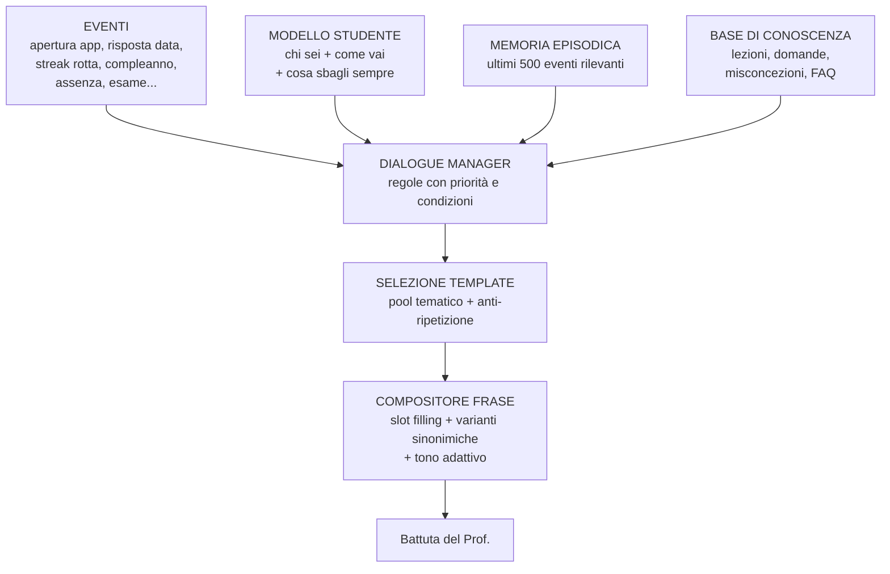
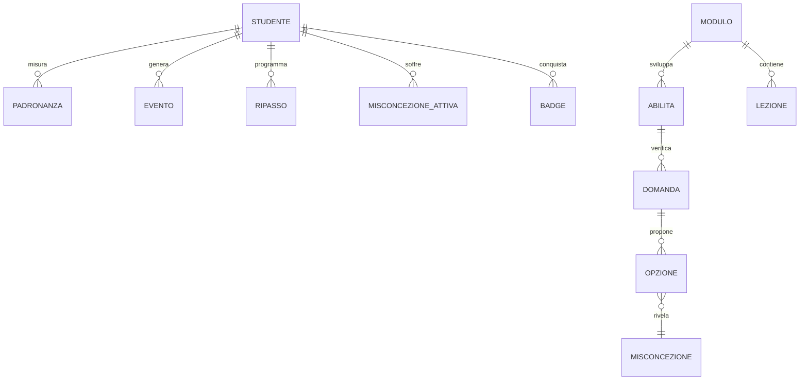

# CYBER SENSEI — Scuola di White Hacking Difensivo

**Documento di progetto — v1.1**
App Android (APK) 100% offline, con un professore-IA simulato che insegna, interroga, corregge e spiega **sempre** il perché.

> Il progetto è approvato ed è in costruzione: **Fasi 0, 1 e 2 completate**. Questo documento
> resta il piano di riferimento; lo stato di avanzamento è nella [roadmap](#13-roadmap-in-fasi).

---

## Indice

1. [Visione e principi](#1-visione-e-principi)
2. [Il professore: come funziona un'IA finta che sembra vera](#2-il-professore-come-funziona-unia-finta-che-sembra-vera)
3. [Il sistema anti-fortuna (la tua richiesta chiave)](#3-il-sistema-anti-fortuna)
4. [Struttura didattica: i 4 livelli](#4-struttura-didattica-i-4-livelli)
5. [Programma completo (curriculum)](#5-programma-completo-curriculum)
6. [I laboratori interattivi](#6-i-laboratori-interattivi)
7. [Architettura tecnica](#7-architettura-tecnica)
8. [Il database invisibile: modello dati](#8-il-database-invisibile-modello-dati)
9. [Schema dei contenuti (il "cervello" del prof)](#9-schema-dei-contenuti)
10. [Interfaccia e schermate](#10-interfaccia-e-schermate)
11. [Gamification, motivazione e diploma](#11-gamification-motivazione-e-diploma)
12. [Privacy, etica e legalità](#12-privacy-etica-e-legalità)
13. [Roadmap in fasi](#13-roadmap-in-fasi)
14. [Come otterrai l'APK](#14-come-otterrai-lapk)
15. [Rischi e come li evitiamo](#15-rischi-e-come-li-evitiamo)
16. [Decisioni che servono da te](#16-decisioni-che-servono-da-te)

---

## 1. Visione e principi

**Che cosa costruiamo:** non un quiz. Una **scuola tascabile** con un docente personale che ti conosce, ti segue nel tempo, si ricorda dei tuoi errori, ti richiama quando sparisci e non ti lascia mai passare avanti senza aver capito.

**I 7 principi non negoziabili del progetto:**

| # | Principio | Cosa significa in pratica |
|---|-----------|---------------------------|
| 1 | **Zero cloud, zero costi** | Nessuna API key, nessuna chiamata di rete. L'app non chiede nemmeno il permesso `INTERNET`. Costo di esercizio: **0 €**, per sempre. |
| 2 | **Mai una risposta senza spiegazione** | Giusta o sbagliata, il prof spiega *perché*. Sempre. Nessuna eccezione. |
| 3 | **La fortuna non fa punteggio** | Chi indovina a caso viene individuato e rimandato indietro (vedi §3). |
| 4 | **Il database non si vede** | Nessuna schermata "impostazioni database", nessun caricamento visibile. Tutto è già dentro l'APK e lavora da solo. |
| 5 | **Difensivo, etico, legale** | Insegniamo a **difendere** e a capire l'attacco per bloccarlo. Nessun tool offensivo reale, nessun bersaglio reale. Tutti i lab sono simulatori chiusi. |
| 6 | **Offline totale** | Funziona in metropolitana, in aereo, in montagna. Nessuna sincronizzazione, nessun account. |
| 7 | **Progressione dimostrabile** | Ogni livello si sblocca solo con una padronanza misurata, non con "ho cliccato avanti". |

**Chi è lo studente tipo:** tu. Zero prerequisiti tecnici richiesti all'ingresso. Alla fine del percorso: capacità di ragionare come un analista blue-team, di difendere i propri sistemi e di sostenere una conversazione tecnica seria sulla sicurezza.

---

## 2. Il professore: come funziona un'IA finta che sembra vera

Il cuore del progetto. Il professore si chiama **Prof. Hackstein White** — in breve **Prof. White**, e il cognome non è casuale: è il cappello bianco travestito da anagrafe.

**Il segreto:** un'IA vera sembra intelligente perché *sa*. La nostra sembrerà intelligente perché **ricorda** e **osserva**. La memoria personale, in percezione, batte l'intelligenza generativa. Un professore che ti dice *"Francesco, è la terza volta in dieci giorni che confondi hashing e cifratura — stavolta te la spiego in un altro modo"* sembra più vivo di qualunque chatbot generico.

### 2.1 Le 6 componenti del motore



**1) Modello studente** — quello che l'app sa di te:
- *Statico* (dall'onboarding): nome, come vuoi essere chiamato, data di nascita → **segno zodiacale** ed età, città/fuso, obiettivo (curiosità / lavoro / proteggere la famiglia / studio), tempo giornaliero disponibile, tono preferito (amichevole / formale / militaresco / ironico), livello autodichiarato.
- *Dinamico* (calcolato in silenzio): padronanza 0–100 per ogni micro-abilità, elenco misconcezioni attive, tempo medio di risposta, fascia oraria in cui studi di più, tasso di risposte "fortunate", streak, assenze, argomenti che ti annoiano (abbandoni ripetuti), argomenti che ti accendono (sessioni lunghe).

**2) Memoria episodica** — un diario interno che il prof cita: *"la scorsa settimana hai chiuso l'app in mezzo alla lezione sul DNS, ci torniamo?"*, *"il tuo record è 12 giorni di fila, siamo a 9"*.

**3) Base di conoscenza** — lezioni, domande, e soprattutto il **catalogo delle misconcezioni**: ogni risposta sbagliata possibile è etichettata con *l'errore di ragionamento specifico* che c'è dietro, e ha una spiegazione dedicata scritta apposta per quell'errore.

**4) Dialogue manager** — ~250 regole del tipo:
```
SE evento = risposta_corretta
   E confidenza_dichiarata = bassa
   E tempo_risposta < 3s
   E padronanza(abilità) < 40
ALLORA → pool "sospetto_tiro_a_indovinare" (priorità 90)
```
La regola a priorità più alta che matcha vince. Fallback sempre presenti, mai silenzio.

**5) Composizione linguistica** — da poche centinaia di template nascono decine di migliaia di frasi diverse:
```
"{saluto_orario}, {nome}. {commento_streak} Oggi {verbo_proposta} {argomento}: {gancio}."
```
dove ogni slot pesca da liste di varianti (con seed deterministico + buffer anti-ripetizione delle ultime N frasi usate). Risultato: **non si ripete mai in modo evidente** e non serve alcun modello linguistico.

**6) Comprensione delle tue domande libere (mini-NLU offline)** — puoi scrivere al prof "prof, ma la VPN mi rende anonimo?" e ottenere una risposta pertinente, senza IA vera:
- normalizzazione del testo italiano (accenti, stopword, radici delle parole)
- **indice TF‑IDF locale** costruito sui contenuti del corso + ~400 FAQ scritte a mano
- match per similarità coseno + correzione refusi (distanza di Levenshtein) + dizionario sinonimi di settore (*password = pwd = parola d'ordine*, *virus ≈ malware*)
- soglia di confidenza: sopra → risponde con il paragrafo giusto della lezione; sotto → *"Questa non l'abbiamo ancora affrontata, la vedremo al livello Intermedio. Nel frattempo però ti dico la cosa più vicina che so..."* (che è comunque una risposta utile, mai un muro).

### 2.2 Le personalizzazioni "civetta" (quelle che vendono l'illusione)

Piccoli tocchi a costo quasi zero, effetto enorme:
- **Compleanno**: schermata speciale, XP bonus, *"Auguri! Regalo: ti ho preparato una lezione fuori programma"*.
- **Segno zodiacale**: battute ricorrenti coerenti col segno (*"da buon Scorpione non ti fidi di nessuno: ottima predisposizione per il Zero Trust, ne parliamo al livello 3"*). Usato con leggerezza, ~1 volta ogni 15 interazioni.
- **Ora del giorno**: *"le 2 di notte... il tuo cervello a quest'ora ricorda il 30% in meno. Facciamo un ripasso leggero invece di un argomento nuovo?"*.
- **Ritorno dopo assenza**: 3 gg → normale; 10 gg → *"ti stavo per denunciare come persona scomparsa"*; 30 gg → ripartenza morbida con ripasso guidato, mai colpevolizzante.
- **Riconoscimento pattern**: *"noto che sbagli sempre le domande sulle porte di rete dopo le 22. Coincidenza?"*.
- **Il prof cambia umore**: soddisfatto, esigente, preoccupato, orgoglioso — stato calcolato dall'andamento, riflesso nel tono e nell'avatar.

### 2.3 Cosa NON farà (onestà tecnica)

Non inventerà contenuti nuovi, non discuterà di argomenti fuori corso, non sosterrà una conversazione libera aperta. **Ma dentro il suo dominio sembrerà più preparato di un chatbot generico**, perché ogni sua frase è scritta da chi la materia la conosce. È la differenza tra un attore con un ottimo copione e uno che improvvisa.

---

## 3. Il sistema anti-fortuna

Hai chiesto espressamente che rispondere giusto per caso non debba passare. È il pezzo più originale del progetto. Cinque meccanismi che lavorano insieme:

**1. Dichiarazione di confidenza.** Dopo ogni risposta, prima di sapere l'esito: *"quanto sei sicuro?"* → 🤔 Tiro a indovinare / 😐 Abbastanza / 😎 Sicurissimo.

| | Risposta giusta | Risposta sbagliata |
|---|---|---|
| **Sicuro** | XP pieno + *"perfetto, e sapevi anche perché"* | 🚨 **Allarme rosso**: misconcezione radicata → mini-lezione di recupero immediata |
| **Insicuro** | XP ridotto + **spiegazione approfondita obbligatoria** + domanda rimessa in coda | XP 0, nessun rimprovero, spiegazione dal principio |

**2. Distrattori diagnostici.** Ogni opzione sbagliata non è riempitivo: rappresenta un errore di ragionamento preciso e ha la sua confutazione dedicata. Sbagliare diventa informazione utile per il prof.

**3. Varianti isomorfe.** Ogni concetto ha 3–5 domande diverse che testano la stessa cosa da angolazioni diverse. Se becchi la A per caso, tra qualche giorno arriva la C: la fortuna non si ripete tre volte.

**4. "Spiegalo tu".** Nei momenti chiave il prof ribalta i ruoli: *"scrivimi con parole tue perché il salt rende inutili le rainbow table"*. Il testo viene valutato in locale con una **checklist di concetti-chiave** (keyword + sinonimi + negazioni); il prof risponde con *"hai centrato 2 punti su 3, ti manca questo"*. Non è correzione semantica perfetta, ma è una spinta enorme alla comprensione reale.

**5. Padronanza, non punteggio.** Ogni micro-abilità ha un valore 0–100 aggiornato con un modello tipo *Bayesian Knowledge Tracing* semplificato, che tiene conto di: esito, confidenza, tempo impiegato, tentativi precedenti, tempo trascorso (decadimento). **Un livello si sblocca solo con padronanza media ≥ 80% e nessuna abilità sotto il 60%.** E il **ripasso a intervalli crescenti** (algoritmo tipo SM‑2) riporta a galla le cose che stanno per essere dimenticate — *"il tuo cervello sta per buttare via il threat modeling, recuperiamolo in 4 domande"*.

---

## 4. Struttura didattica: i 4 livelli

```
🎒 LIVELLO 0 — INTRODUZIONE "Il primo giorno di scuola"     ~30-40 min   5 micro-lezioni
🌱 LIVELLO 1 — FACILE        "Le fondamenta"                ~8-10 ore    8 moduli
⚙️  LIVELLO 2 — INTERMEDIO    "Il mestiere"                  ~20-25 ore   9 moduli
🛡️  LIVELLO 3 — IL DIFENSORE                 ~30-40 ore   10 moduli + capstone
```

**Struttura di ogni modulo:**
```
Modulo
 ├── Lezione teorica     → a schede brevi, 2-4 min l'una, con analogie della vita reale
 ├── Domanda al volo     → 1 domanda dentro la lezione, per tenere l'attenzione viva
 ├── Laboratorio         → si tocca con mano, in simulatore
 ├── Interrogazione      → 8-15 domande miste con confidenza e spiegazioni
 ├── Ripasso programmato → riappare nei giorni successivi
 └── Esame di modulo     → sblocca il modulo successivo
```
Ogni livello si chiude con un **Esame di Livello** e una **cerimonia** (badge, certificato, il prof che si commuove a modo suo).

**Formati di domanda previsti:** scelta multipla, vero/falso con motivazione, riordino di sequenza (es. fasi di un incident response), abbinamento (minaccia ↔ contromisura), "trova l'anomalia" nell'immagine/log, completamento comando, scenario ramificato ("sei il responsabile IT, cosa fai per primo?"), risposta aperta valutata a checklist.

---

## 5. Programma completo (curriculum)

### 🎒 Livello 0 — Introduzione (mini-livello)

| # | Micro-lezione | Contenuto |
|---|---|---|
| 0.1 | **Conosciamoci** | L'onboarding: il prof ti intervista (nome, come chiamarti, data di nascita → segno, obiettivo, tempo, tono). Non è un form: è un dialogo. |
| 0.2 | **Chi è l'hacker etico** | White / grey / black hat. Sfatiamo il mito del "cattivo col cappuccio". |
| 0.3 | **Il patto** | Codice etico + cenni legali (in Italia: art. 615‑ter c.p., accesso abusivo). **Firmi il patto con il dito sullo schermo** — sbloccante, resta nel diploma finale. |
| 0.4 | **Le tre parole magiche** | Confidenzialità, Integrità, Disponibilità (la triade CIA) spiegate con una cassaforte, una ricetta e un negozio. |
| 0.5 | **Come funziona questa scuola** | Come studia bene un cervello umano, perché ti farò domande "a tradimento" nei giorni successivi, cos'è la padronanza, come si sale di livello. |

→ Uscita: primo badge **🎓 Matricola** e sblocco del Livello 1.

### 🌱 Livello 1 — Facile: "Le fondamenta"

| # | Modulo | Argomenti principali | Lab |
|---|---|---|---|
| 1.1 | Identità e password | Entropia, passphrase, riuso, password manager, data breach | **Password Forge** |
| 1.2 | Il secondo fattore | MFA, TOTP, chiavi FIDO2, perché l'SMS è il più debole, SIM swap | Simulatore TOTP |
| 1.3 | Phishing e ingegneria sociale | Pretexting, urgenza, autorità, deepfake vocali, truffe italiane reali (SPID, corriere, banca) | **Casella Sospetta** |
| 1.4 | Aggiornamenti e backup | CVE, patch, regola 3‑2‑1, ransomware e perché il backup ti salva | Simulatore ransomware |
| 1.5 | Come funziona Internet | IP, DNS, HTTP vs HTTPS, cosa vede davvero il gestore Wi‑Fi, cosa fa (e non fa) una VPN | **Traccia il Pacchetto** |
| 1.6 | Lo zoo del malware | Virus, worm, trojan, ransomware, spyware, adware, rootkit, botnet | Riconoscimento sintomi |
| 1.7 | Android sicuro | Permessi, sideloading, Play Protect, app-cloni, stalkerware | **Audit dei permessi** |
| 1.8 | Privacy e impronta digitale | Tracker, dati personali, GDPR per cittadini, cosa lasci in giro | Diario dell'impronta |

### ⚙️ Livello 2 — Intermedio: "Il mestiere"

| # | Modulo | Argomenti principali | Lab |
|---|---|---|---|
| 2.1 | Crittografia applicata | Simmetrica/asimmetrica, hash ≠ cifratura, salt & pepper, bcrypt/Argon2 | **Banco di Crittografia** |
| 2.2 | TLS e certificati | Handshake, PKI, CA, certificate pinning, cosa significa il lucchetto | Ispettore di certificati |
| 2.3 | Autenticazione e sessioni | Cookie, token, JWT, scadenze, hijacking di sessione, OAuth in due parole | Anatomia di un JWT |
| 2.4 | Reti in profondità | TCP/IP, porte, firewall, NAT, segmentazione, sniffing | **Lettore di pacchetti** |
| 2.5 | OWASP Top 10 | XSS, SQLi, IDOR, CSRF, SSRF, misconfig — *spiegate per difendersi*, con input sanitization e query parametrizzate | **Cantiere Web** (sandbox finta) |
| 2.6 | Hardening di sistema | Minimo privilegio, utenti e permessi Unix, servizi inutili, superficie d'attacco | Console simulata |
| 2.7 | Leggere i log (blue team) | Formati di log, correlazione, trovare l'ago nel pagliaio, baseline | **Caccia all'Anomalia** |
| 2.8 | Threat modeling | STRIDE, DFD, "chi mi vuole colpire e come", valutazione del rischio | Modella il tuo scenario |
| 2.9 | Sviluppo Android sicuro | Keystore, storage cifrato, cleartext traffic, obfuscation, secret nel codice | Revisione manifest |

### 🛡️ Livello 3 — Difficile: "Il difensore"

| # | Modulo | Argomenti principali | Lab |
|---|---|---|---|
| 3.1 | Anatomia di un attacco | Cyber Kill Chain, MITRE ATT&CK, TTP, dall'accesso iniziale all'esfiltrazione | Mappa la campagna |
| 3.2 | Incident Response | NIST: preparazione → identificazione → contenimento → eradicazione → recupero → lezioni apprese | **Sala Crisi** |
| 3.3 | Detection engineering | SIEM, regole di detection, falsi positivi, piramide del dolore, tuning | Scrivi la regola |
| 3.4 | Forensics di base | Volatilità dei dati, immagini disco, catena di custodia, timeline, artefatti | Timeline forense |
| 3.5 | Difesa di rete moderna | Zero Trust, microsegmentazione, IDS/IPS, honeypot, deception | Progetta l'architettura |
| 3.6 | Analisi di un APK (difensiva) | Manifest, permessi eccessivi, stringhe, offuscamento, indicatori di malware mobile | **Laboratorio APK** |
| 3.7 | Supply chain e SDLC sicuro | Dipendenze, SBOM, firma del codice, CI/CD, secure code review | Caccia alla dipendenza |
| 3.8 | Cloud e container | IAM, bucket esposti, segreti, isolamento container, superficie cloud | Configurazione errata |
| 3.9 | Crisi, legge e comunicazione | GDPR (72h), NIS2, quando e come si notifica, comunicare a capi e clienti | Scrivi la notifica |
| 3.10 | **CAPSTONE — L'Incidente** | Simulazione completa di 45–60 min: azienda sotto attacco, decisioni a catena con conseguenze reali, il prof valuta ogni scelta e a fine partita fa il **debriefing** come un vero istruttore | Scenario ramificato |

→ **Diploma finale** con nome, data, punteggio, tempo totale di studio, firma del Prof. Hackstein White. Esportabile come immagine/PDF.

---

## 6. I laboratori interattivi

Tutto simulato dentro l'app, nessun bersaglio reale, nessun tool offensivo. Sono la parte che trasforma la teoria in mestiere.

| Lab | Cosa fai davvero |
|---|---|
| 🔐 **Password Forge** | Scrivi password, vedi in tempo reale l'entropia in bit e il tempo di crack stimato per diversi scenari; scopri perché `P@ssw0rd!` cade in 3 secondi e `cavallo-batteria-graffetta-42` no |
| 📧 **Casella Sospetta** | 20 email finte in una inbox: decidi *legittima / phishing / spam*, il prof evidenzia gli indizi che hai perso (mittente, dominio, urgenza, link mascherato) |
| 📦 **Traccia il Pacchetto** | Animazione: il tuo messaggio attraversa router, DNS, TLS; vedi chi legge cosa in ogni punto, con e senza HTTPS, con e senza VPN |
| 🧪 **Banco di Crittografia** | Cifri e decifri con Cesare, XOR, AES; calcoli hash; vedi l'effetto valanga; provi due password uguali con salt diversi |
| 📡 **Lettore di pacchetti** | Un mini-Wireshark finto e leggibile: identifica il protocollo, la porta, il traffico anomalo |
| 🏗️ **Cantiere Web** | Un sito finto e vulnerabile *dentro l'app*: vedi l'input malevolo passare, poi applichi la difesa e lo vedi bloccato. Zero rischi legali, massimo effetto didattico |
| 🔍 **Caccia all'Anomalia** | 200 righe di log, trova le 3 righe che raccontano l'intrusione. Cronometro e punteggio |
| 🤖 **Audit dei permessi** | Una lista di app finte con i loro permessi: quali sono giustificati? La torcia che vuole rubrica e microfono? |
| 🧬 **Laboratorio APK** | Manifest, permessi, stringhe sospette di un APK finto: è malware o no? Motiva |
| 🚨 **Sala Crisi** | Ore 3:47, i server si cifrano. Decidi cosa fare, in che ordine, con timer. Ogni scelta cambia il finale |

---

## 7. Architettura tecnica

**Stack proposto:**

| Ambito | Scelta | Perché |
|---|---|---|
| Linguaggio | **Kotlin** | Standard Android moderno |
| UI | **Jetpack Compose + Material 3** | UI dichiarativa, animazioni fluide, tema chiaro/scuro |
| Database | **Room (SQLite)** | Locale, invisibile, robusto, migrazioni gestite |
| Preferenze | **DataStore** | Profilo e impostazioni |
| Contenuti | **JSON in `assets/`** + validatore | Contenuti separati dal codice: si aggiornano senza toccare la logica |
| Notifiche | **WorkManager** | Il prof ti richiama per il ripasso, in locale |
| DI | **Hilt** | Struttura pulita, testabile |
| Min SDK | **24 (Android 7)** | Copre >97% dei dispositivi |
| Permessi | **solo notifiche** | ❌ Nessun `INTERNET`. Verificabile da chiunque: un'app di sicurezza deve essere essa stessa un esempio |
| Peso | **~7 MB** | Contenuti e illustrazioni vettoriali. Niente modelli: lo Studio non interpreta, si naviga |

**Moduli Gradle (architettura pulita, multi-modulo):**

```
cybersensei/
├── app/                    → assemblaggio, navigazione, tema
├── core/
│   ├── ui/                 → design system, componenti riusabili
│   ├── database/           → Room: entità, DAO, migrazioni
│   ├── model/              → modelli di dominio
│   └── common/             → utility, estensioni
├── engine/
│   ├── tutor/              → 🧠 dialogue manager, regole, composizione frasi
│   ├── mastery/            → padronanza, BKT semplificato, anti-fortuna
│   ├── scheduler/          → ripasso a intervalli (SM-2)
│   └── nlu/                → TF-IDF, similarità, matching FAQ
├── feature/
│   ├── onboarding/  lesson/  quiz/  labs/  progress/  professor/  exam/  diploma/
├── content/                → JSON: lezioni, domande, misconcezioni, dialoghi, FAQ
└── tools/
    └── content-validator/  → controlla i contenuti a ogni build (CI)
```

**Regola d'oro:** il motore del tutor non sa nulla di cybersecurity, e i contenuti non sanno nulla di codice. Così potremo aggiungere 300 domande nuove senza ricompilare la logica — e, se un giorno vorrai, creare la stessa app su un'altra materia cambiando solo la cartella `content/`.

---

## 8. Il database invisibile: modello dati

Tu non lo vedrai mai. Lavora sotto, a ogni tocco.



**Tabelle principali:**

| Tabella | Campi chiave |
|---|---|
| `studente` | nome, appellativo, data nascita, segno, obiettivo, tono, minuti/giorno, data iscrizione, patto firmato |
| `padronanza` | abilità, valore 0‑100, n. tentativi, ultima verifica, decadimento |
| `risposta` | domanda, esito, confidenza dichiarata, tempo impiegato, **flag sospetto-fortuna** |
| `misconcezione_attiva` | quale, quante volte, stato (attiva/in recupero/superata) |
| `evento` | tipo, timestamp, dati (per la memoria episodica del prof) |
| `ripasso` | abilità, prossima data, intervallo corrente, fattore di facilità |
| `progresso` | livello, modulo, lezione, completamento, esami superati |
| `battuta_usata` | id template, timestamp (anti-ripetizione) |
| `statistiche` | XP, streak, record streak, minuti totali, sessioni, fascia oraria preferita |

Tutto in chiaro nel dispositivo (dati non sensibili), backup escluso dal cloud di default, e una voce nascosta in impostazioni: **"Ricomincia da capo"** con doppia conferma.

---

## 9. Schema dei contenuti

Il "cervello" del prof è dichiarativo. Esempio reale di una domanda:

```json
{
  "id": "q_crypto_hash_vs_cifra_01",
  "abilita": "distinguere_hash_da_cifratura",
  "livello": 2,
  "tipo": "scelta_multipla",
  "domanda": "Un sito subisce un furto del database. Le password erano salvate con hash + salt (Argon2). Qual è la conseguenza più corretta?",
  "opzioni": [
    {
      "id": "a",
      "testo": "L'attaccante può decifrare le password conoscendo l'algoritmo",
      "corretta": false,
      "misconcezione": "hash_reversibile",
      "confutazione": "Qui sta il punto che quasi tutti sbagliano: l'hash **non si decifra**, perché non è cifratura. È una funzione a senso unico: distrugge informazione. Non esiste una 'chiave' che lo riporti indietro, nemmeno per chi l'ha creato. L'attaccante può solo *provare* a indovinare la password e ri-hasharla per confrontare — e Argon2 è progettato apposta per rendere ogni tentativo lentissimo e costoso in memoria."
    },
    {
      "id": "b",
      "testo": "Le password sono al sicuro per sempre, non serve cambiarle",
      "corretta": false,
      "misconcezione": "falsa_sicurezza_totale",
      "confutazione": "Troppo ottimista. Un buon hash *rallenta enormemente* l'attaccante, non lo ferma: una password debole come `giulia1990` cade comunque, perché è nei dizionari. E il tempo lavora per l'attaccante. Regola: dopo un breach si cambia, sempre."
    },
    {
      "id": "c",
      "testo": "L'attaccante deve tentare attacchi a forza bruta o a dizionario, resi molto lenti dal salt e da Argon2",
      "corretta": true
    },
    {
      "id": "d",
      "testo": "Il salt cifra la password rendendola illeggibile",
      "corretta": false,
      "misconcezione": "salt_confuso_con_chiave",
      "confutazione": "Il salt non cifra nulla e **non è segreto**: è pubblico, sta accanto all'hash nel database. Il suo unico compito è rendere ogni hash unico, così due utenti con la stessa password hanno hash diversi e le rainbow table precalcolate diventano carta straccia."
    }
  ],
  "spiegazione_corretta": "Esatto. Con hash + salt l'attaccante non ha una scorciatoia matematica: gli resta solo la forza bruta, un tentativo alla volta. E qui entra in gioco Argon2, che è deliberatamente lento e affamato di memoria: se una GPU riusciva a testare miliardi di MD5 al secondo, con Argon2 ben configurato scende a poche migliaia. Il salt aggiunge il colpo di grazia: niente tabelle precalcolate, ogni password va attaccata singolarmente.",
  "nel_mondo_reale": "È esattamente quello che ha salvato milioni di utenti nel breach di Dropbox del 2012: le password erano protette con bcrypt, e la maggior parte non è mai stata violata. Nel breach di RockYou (2009), invece, erano in chiaro: 32 milioni di password lette come un elenco telefonico.",
  "domanda_di_controllo": "Se il salt è pubblico, perché serve a qualcosa?",
  "varianti_isomorfe": ["q_crypto_hash_vs_cifra_02", "q_crypto_hash_vs_cifra_03"],
  "difficolta": 0.62,
  "tempo_atteso_sec": 40
}
```

Ed ecco un template di dialogo del prof:

```json
{
  "id": "tpl_corretta_ma_insicuro",
  "evento": "risposta_corretta",
  "condizioni": { "confidenza": "bassa", "padronanza_max": 60 },
  "priorita": 85,
  "varianti": [
    "{nome}, è giusta — ma tu non ne eri convinto, e questo per me vale più dell'esito. Fermiamoci: te la spiego finché non diventa ovvia.",
    "Risposta corretta, {appellativo}. Però hai esitato: significa che hai intuito, non capito. L'intuito in sicurezza non basta, quando c'è un incidente in corso serve certezza. Andiamo a fondo.",
    "Bravo. E adesso la parte che conta davvero: *perché* è giusta. Perché se non lo sai, la prossima volta che questa domanda cambia vestito ti frega."
  ]
}
```

**Volume di contenuti previsto** (scritti da zero, in italiano, con cura editoriale):

| Elemento | Quantità stimata |
|---|---|
| Micro-lezioni | ~130 |
| Domande con spiegazioni complete | ~850 |
| Misconcezioni catalogate e confutate | ~180 |
| Template di dialogo del prof | ~600 (→ decine di migliaia di frasi combinate) |
| FAQ per le domande libere | ~400 |
| Laboratori interattivi | 10 |
| Casi ramificati | 16 (di cui 1 finale, «L'Incidente») — **tutti scritti** |

---

## 9-bis. I casi: piccole storie a bivi, sparse lungo il programma

Il capstone unico aveva un difetto che nessuna riscrittura poteva togliere: si giocava una
volta sola, e solo alla fine. Uno studente passa mesi sul programma e **decide** qualcosa una
volta. I casi lo spargono.

**La regola, una sola.** Un caso è costruito soltanto su materia già spiegata, e si apre
quando i moduli da cui pesca sono stati letti — la stessa frase che governa i lucchetti in
tutto il resto dell'app. La regola è cumulativa, non esclusiva: un caso di livello 1 può
usare l'introduzione e il livello 1, perché l'etica serve dappertutto e far tornare la materia
vecchia dentro una storia nuova è il ripasso travestito da gioco. È verificata da un test, non
dall'attenzione di chi scrive.

**Come si distribuiscono.**

| Livello | Moduli | Casi | Scene l'uno | Stato |
|---|---|---|---|---|
| Introduzione | 1 | 1 | 5 | «La falla» |
| 1 · Le fondamenta | 8 | 3 | 6 | «Il rimborso», «La torcia», «Rete aperta» |
| 2 · Il mestiere | 9 | 5 | 6 | «La catena», «L'utente sbagliato», «Il perimetro», «Le tracce», «La chiave» |
| 3 · Il difensore | 9 | 6 + «L'Incidente» | 6, il finale 13 | «La regola», «Il portatile», «Il pacchetto», «La dipendenza», «Il deposito», «Le stanze» |

Sedici casi in tutto. Il numero non è arbitrario: **un caso per gruppo di moduli**, così ogni
storia ha un soggetto e non si contende il materiale con le altre. Quindici casi su nove
moduli significherebbe tre storie che si giocano lo stesso backup da ripristinare, e la terza
volta lo studente smette di crederci.

Sotto le quattro scene non si scende: serve spazio perché una decisione presa all'inizio torni
addosso alla fine, che è l'unica cosa che un caso sa fare e un'interrogazione no.

**I misti** non sono una categoria a parte: sono l'**ultimo caso di ogni livello**, quello che
può pescare da tutto lo studiato fino a lì. Il meccanismo — vai bene, poi ti frega — nel motore
esiste già: sono le scene-punizione dell'Incidente (`il risveglio`, `la sorpresa`), raggiunte
solo da chi ha sbagliato la mossa prima.

**Che storie sono.** All'Introduzione non può esserci nessun attacco: quattro competenze di
etica, legge, triade CIA e metodo non danno di che difendersi, e una scena dove ogni scelta è
indovinare insegna il contrario di quello che serve. Il caso dell'Introduzione è un **dilemma**
— trovi per caso una falla, e devi decidere cosa farne. Da Facile in poi gli attacchi ci sono,
sempre raccontati **dal lato di chi difende**: cosa vedi nei log, cosa è successo. Mai una
ricetta operativa, che è la regola 3 applicata anche alla narrativa.

**Aggiungerne uno** è un file JSON e una riga in `content/scenari/casi.json`. Nessun codice:
è la proprietà che rende sensato continuare ad aggiungerne finché vale la pena.

---

## 10. Interfaccia e schermate

**Identità visiva proposta:** terminale notturno elegante — fondo blu‑nero profondo, accenti verde-menta e ambra, tipografia monospaziata solo dove ha senso (log, comandi), il resto pulito e leggibile. Tema chiaro incluso. Animazioni sobrie e mai bloccanti. Zero pubblicità, zero popup, mai.

| Schermata | Contenuto |
|---|---|
| **Aula** (home) | Il prof ti accoglie con la battuta del giorno, ti propone il prossimo passo, mostra streak e ripassi in scadenza |
| **Percorso** | La mappa dei 4 livelli con moduli sbloccati/bloccati, come una metropolitana |
| **Lezione** | Schede scorrevoli, testo breve, illustrazioni, glossario a tocco lungo su ogni termine tecnico |
| **Interrogazione** | Domanda → confidenza → esito → **spiegazione completa** → domanda di controllo |
| **Laboratorio** | Schermo pieno, interattivo |
| **Studio del Prof.** | Chiedi tu qualcosa (mini-NLU), rivedi le sue osservazioni su di te, cambia il tono con cui ti parla |
| **Pagella** | Padronanza per abilità (grafico radar), punti deboli, tempo di studio, andamento settimanale |
| **Bacheca** | Badge, certificati, diploma |
| **Glossario** | ~300 termini, ricercabile, offline |
| **Impostazioni** | Tono, notifiche, tema, dimensione testo, ricomincia |

**Accessibilità:** contrasto AA, testo scalabile, TalkBack, nessun contenuto affidato al solo colore, tutte le animazioni disattivabili.

---

## 11. Gamification, motivazione e diploma

Senza trasformarlo in un giochino: la motivazione serve lo studio, non il contrario.

- **XP** ponderati sulla confidenza (indovinare rende poco, capire rende molto)
- **Streak** giornaliero con "gettone salvavita" guadagnabile (per non punire una giornata storta)
- **Badge** tematici: *Occhio di Falco* (10 phishing di fila), *Guardiano Notturno*, *Nemico della Fortuna* (30 risposte "sicuro" corrette di fila), *Fenice* (rientro dopo 30 giorni)
- **Gradi** che crescono col percorso: Matricola → Apprendista → Analista → Difensore → Sensei
- **Notifiche del prof** (max 1/giorno, disattivabili, mai insistenti): *"3 concetti stanno per uscirti dalla testa. 4 minuti e li salviamo."*
- **Diploma finale** condivisibile, con statistiche reali del tuo percorso

---

## 12. Privacy, etica e legalità

Un'app che insegna sicurezza deve essere irreprensibile:

- **Zero raccolta dati.** Niente analytics, niente crash reporting remoto, niente account. I dati restano nel telefono e muoiono con la disinstallazione.
- **Nessun permesso di rete.** Dimostrabile ispezionando il manifest — e lo faremo fare *a te* come esercizio nel modulo 3.6.
- **Solo difesa.** Nessun tool funzionante di attacco, nessun bersaglio reale, nessun payload utilizzabile. Le tecniche offensive si studiano *come si studia l'anatomia di una malattia in medicina*: per curarla.
- **Cornice legale italiana** insegnata esplicitamente (art. 615‑ter, 615‑quater, 617‑quater c.p.; GDPR; NIS2), con il messaggio ripetuto: *testare senza autorizzazione scritta è reato, anche "solo per curiosità", anche se non fai danni*.
- **Patto etico firmato** all'ingresso e richiamato prima di ogni modulo sensibile.
- Contenuti adatti dai 14 anni in su.

---

## 13. Roadmap in fasi

Ogni fase produce qualcosa di **verificabile**. Dalla Fase 2 in poi hai un APK installabile che cresce.

| Fase | Cosa costruiamo | Consegna | Stima |
|---|---|---|---|
| **0 — Fondamenta** ✅ | Progetto Gradle multi-modulo, tema, navigazione, CI che sforna l'APK | App che si avvia, build automatica funzionante | fatta |
| **1 — Il cervello** ✅ | Motore tutor, regole, composizione frasi, padronanza, ripasso, mini-NLU + **test automatici** | Motore testato a parte, prima ancora dell'interfaccia | fatta |
| **2 — Fetta verticale ⭐** ✅ | Onboarding + Livello 0 completo end‑to‑end: il prof ti conosce, ti insegna, ti interroga, ti spiega | **🎉 Primo APK vero da installare e provare.** | fatta |
| **3 — Livello Facile** ✅ | 8 moduli, 72 domande con confutazione per ogni opzione sbagliata, badge, sblocco dei livelli | APK con un corso completo utilizzabile | fatta (lab ed esame rinviati) |
| **3.5 — Studio e Pagella** ✅ | Domande libere offline su 73 argomenti; pagella con padronanza misurata per competenza, punti deboli in ordine e presenze | Nessuna sezione dell'app è più vuota | fatta |
| **4 — Laboratori** | I 10 lab, il motore degli scenari ramificati | APK con la parte pratica completa | 2 tappe |
| **5 — Intermedio** ✅ | 9 moduli, 81 domande, 138 schede di lezione | APK con due corsi completi | fatta (pagella e glossario rinviati) |
| **6 — Difficile + Capstone** ✅ | 9 moduli, 81 domande, capstone «L'Incidente» con 13 scene e debriefing | APK con il percorso integrale | fatta (resta il diploma) |
| **7 — Rifinitura** | Accessibilità, animazioni, revisione editoriale di tutti i testi, ottimizzazione, APK firmato di release | **Versione 1.0** | 2 tappe |

**Come lavoreremo:** a ogni fase committo su `claude/apk-white-hacking-edu-k21q2d`, ti riassumo cosa è cambiato e ti dico come provarlo. Tu approvi o correggi, e si va avanti. Se qualcosa non ti piace, si cambia subito — meglio alla Fase 2 che alla Fase 6.

---

## 14. Come otterrai l'APK

Non ti serve installare nulla sul computer:

1. Configuro **GitHub Actions**: a ogni push, il progetto viene compilato in cloud da GitHub (gratis)
2. Vai nella scheda *Actions* del repository → ultima esecuzione → **scarichi l'APK** dagli artifact
3. Sul telefono: consenti l'installazione da fonti sconosciute per il browser, apri il file, installi
4. Da Fase 7 produrremo anche l'**APK firmato di release** (più leggero e ottimizzato) e, volendo, un **AAB** pronto per il Play Store se un giorno vorrai pubblicarla

Ti scriverò una guida passo-passo con screenshot quando arriveremo al primo APK (Fase 2).

---

## 15. Rischi e come li evitiamo

| Rischio | Probabilità | Come lo neutralizziamo |
|---|---|---|
| Il prof risulta ripetitivo dopo una settimana | Alta | Buffer anti-ripetizione, 600 template, varianti combinatorie, tono che evolve con i tuoi progressi. **Da verificare già in Fase 2** |
| L'illusione di IA si rompe ("è solo un if") | Media | La memoria episodica è l'arma segreta: citare fatti passati specifici è ciò che regge l'illusione più di qualunque frase brillante |
| Mole di contenuti enorme, rischio di stancarsi | Alta | Contenuti separati dal codice: l'app funziona anche parziale e cresce a moduli. Nessun blocco |
| Troppa gamification, sembra un giochino | Media | Punteggi discreti, mai animazioni celebrative invasive, il prof resta autorevole |
| Contenuti tecnici che invecchiano | Media | Fondamenti (crittografia, reti, metodo) invecchiano lentamente; le parti volatili sono isolate in file dedicati e aggiornabili |
| L'app viene percepita come "hacking illegale" | Bassa | Nome, descrizione, patto etico, zero tool offensivi, cornice legale esplicita in ogni modulo sensibile |
| Valutazione delle risposte aperte imprecisa | Media | Usata solo per rinforzo, mai per bocciare: il prof commenta ma non penalizza |

---

## 16. Decisioni che servono da te

Rispondi anche solo con un numero e due parole, poi parto.

1. **Nome dell'app**: per ora **Cyber Sensei** — resta cambiabile finché non pubblichiamo
2. ~~**Nome del professore**~~ → deciso: **Prof. Hackstein White**
3. **Carattere del prof**: severo ma giusto (stile professore vecchia scuola) / amichevole e ironico / mentore calmo — **oppure lasciamo scegliere a te dentro l'app all'onboarding** (la mia preferenza)
4. **Lingua**: solo italiano per la 1.0, con la struttura già pronta per l'inglese? (consigliato)
5. **Il capstone finale**: ti convince l'idea della simulazione di crisi con timer e conseguenze, o preferisci un esame classico più lungo?
6. **Ordine di lavoro**: confermi che partiamo con la fetta verticale (Fase 0→2), così vedi presto un APK vero da provare, invece di scrivere prima tutti i contenuti?
7. **C'è qualcosa che manca** o qualche modulo che vuoi aggiungere/togliere dal programma?

---

### La mia opinione onesta sul progetto

È fattibile ed è ambizioso, ma **la parte difficile non è tecnica: è editoriale**. Il codice di un'app così è alla portata; quello che farà la differenza tra "l'ennesima app di quiz" e "la migliore scuola di white hacking in un APK" sono le 850 spiegazioni scritte bene, le 180 misconcezioni prese sul serio e le 600 battute del prof. È lì che va messa la cura, ed è lì che intendo metterla.

Il punto di verità era la **Fase 2**, ed è arrivato: l'APK esiste, il Prof. White ti chiede il nome, ti insegna, ti interroga e ti spiega ogni risposta. Da qui in poi è lavoro di contenuti — tanto, ma senza più incognite sull'impianto.

*Aspetto il tuo giudizio.*
